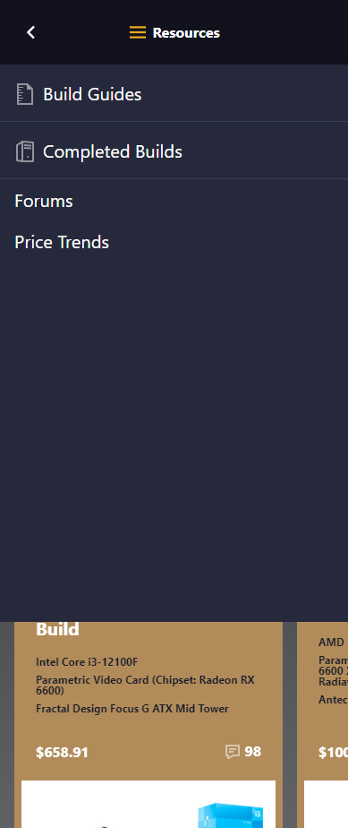

# Procesverslag
Markdown is een simpele manier om HTML te schrijven.  
Markdown cheat cheet: [Hulp bij het schrijven van Markdown](https://github.com/adam-p/markdown-here/wiki/Markdown-Cheatsheet).

Nb. De standaardstructuur en de spartaanse opmaak van de README.md zijn helemaal prima. Het gaat om de inhoud van je procesverslag. Besteedt de tijd voor pracht en praal aan je website.

Nb. Door *open* toe te voegen aan een *details* element kun je deze standaard open zetten. Fijn om dat steeds voor de relevante stuk(ken) te doen.

## Jij

  
uitwerken voor kick-off werkgroep

  ### Auteur:
  Bryan Ortiz Franco

  #### Je startniveau:
  Mijn startniveau is gemiddeld (blauw)

  #### Je focus:
  Ik richt me vooral op responsive en wat surface plane om het wat toegankelijker te maken voor meer mensen
 

## Je website

  
uitwerken voor kick-off werkgroep

  ### Je opdracht:
  Deze website ga ik namaken: https://pcpartpicker.com

  #### Screenshot(s) van de eerste pagina (small screen): 
  Dit is de Home-pagina van PC-partpicker
  

  #### Screenshot(s) van de tweede pagina (small screen):
  Op deze pagina kun je complete PC buils vinden.
  

## Toegankelijkheidstest 1/2 (week 1)

  
uitwerken na test in 1e werkgroep

  ### Bevindingen

  Lijst met je bevindingen die in de test naar voren kwamen:
  - Tekst is gemakkelijk te lezen in alle kleurenblindheid
  - Advertentie staan goed apart
  - Darkmode button verdwijnt en wordt verplaatst naar profiel. Dit zou beter verplaatst worden naar instellingen

  #### Screenreader

  - Er staan veel onzichtbare html text dat niet te zien is maar wel word opgelezen.

  #### Muis en Toetsenbord

  - Er staan veel onzichtbare html text dat niet te zien is maar wel word opgelezen.
  - Headings hebben niet de juiste namen

  #### Motoriek (shocks, elastiekjes)

  - De knoppen zitten te dicht op elkaar, waardoor het bijna onmogelijk is om de gewenste knop in te drukken.

  #### Visueel (brillen, contrast, kleurenblind, dark/light). 
  
  - Blurred vision: text was niet goed te lezen
  - Achromatopsia: de gekleurde hover knoppen zijn niet te zien
  - Dark mode en light zouden een paar veranderingen kunnen krijgen om ze beter te onderscheiden

## Breakdownschets (week 1)

  
uitwerken na afloop 2e werkgroep

  ### De hele pagina: 
  

  ### De drop-down menu: 
  

  ### De Build guides carrousel: 
  

## Voortgang 1 (week 2)

  
uitwerken voor 1e voortgang

  ### Stand van zaken

  hier dit ging goed & dit was lastig (neem ook screenshots op van delen van je website en code)

  - Of mijn HTML en CSS code goed is opgemaakt
  

  - Hoe ik een dropdown menu maak
  - De icontjes vinden voor de website

  ### Agenda voor meeting
  samen met je groepje opstellen

  | Daan           | Jordi              | Lars                                                             | Zennay           |
  | ---            | ---                | ---                                                              | ---              |
  | dit bespreken  | en dit             | Hoe kan ik het beste mijn css structureren?                      | en dan ik dat    |
  | en dat ook nog | dit als er tijd is | background-image werkt niet, waar ligt dat aan?                  | dit wil ik zeker |
  | ...            | ...                | Is het gebruikelijk om af te wisselen in display grid en flex?   | ...              |

  ### Verslag van meeting
  hier na afloop snel de uitkomsten van de meeting vastleggen

- Elke kleur een huisstijl naam geven en het verwijzen naar waar het gebruikt worden. Als : —huisstyle-kleur(); en dan zoals —bg-nav:
- Elke a hef moet in een aparte li
- Elke section een naam geven in ccs
- Div mag gebruikt worden voor styling
- Gebruik Emet om snel te coderen
- Mijn Css een logische volgorde geven
- Afbeeldingen de juiste naam geven

## Voortgang 2 (week 3)

  
uitwerken voor 2e voortgang

  ### Stand van zaken
  - Deze week heb ik weinig tijd gehad om aan mijn website te werken
  - Hoe krijg ik de afbeeldingen goed op plaats?
  - Hoe krijg ik de nav goed aan het werk?
  - hoe kan ik de linker gap weghalen bij mijn carrousel

  ### Agenda voor meeting
  samen met je groepje opstellen

  | Jordi          | Daan               | Zennay       | Lars             |
  | ---            | ---                | ---          | ---              |
  | dit bespreken  | en dit             | en ik dit    | en dan ik dat    |
  | en dat ook nog | dit als er tijd is | nog een punt | dit wil ik zeker |
  | ...            | ...                | ...          | ...              |

  ### Verslag van meeting
  hier na afloop snel de uitkomsten van de meeting vastleggen

  - punt 1
  - punt 2
  - nog een punt
- ...

## Toegankelijkheidstest 2/2 (week 4)

  
uitwerken na test in 8e werkgroep

  ### Bevindingen
  Lijst met je bevindingen die in de test naar voren kwamen (geef ook aan wat er verbeterd is):

  #### Screenreader
  Hier korte omschrijving (met indien nodig afbeeldingen)

  Hier een omschrijving van hoe het opgelost kan worden (met indien nodig afbeeldingen)

  #### Muis en Toetsenbord 
  Hier korte omschrijving (met indien nodig afbeeldingen)

  Hier een omschrijving van hoe het opgelost kan worden (met indien nodig afbeeldingen)

  #### Motoriek (shocks, elastiekjes)
  Hier korte omschrijving (met indien nodig afbeeldingen)

  Hier een omschrijving van hoe het opgelost kan worden (met indien nodig afbeeldingen)

  #### Visueel (brillen, contrast, kleurenblind, dark/light). 
  Hier korte omschrijving (met indien nodig afbeeldingen)

  Hier een omschrijving van hoe het opgelost kan worden (met indien nodig afbeeldingen)

## Voortgang 3 (week 4)

  
uitwerken voor 3e voortgang

  ### Stand van zaken
  hier dit ging goed & dit was lastig (neem ook screenshots op van delen van je website en code)

  ### Agenda voor meeting
  samen met je groepje opstellen

  | student 1      | student 2          | student 3    | student 4        |
  | ---            | ---                | ---          | ---              |
  | dit bespreken  | en dit             | en ik dit    | en dan ik dat    |
  | en dat ook nog | dit als er tijd is | nog een punt | dit wil ik zeker |
  | ...            | ...                | ...          | ...              |

  ### Verslag van meeting
  hier na afloop snel de uitkomsten van de meeting vastleggen

  - punt 1
  - punt 2
  - nog een punt
  - ...

## Eindgesprek (week 5)

  
uitwerken voor eindgesprek

  ### Je uitkomst - karakteristiek screenshots:
  

  ### Dit ging goed/Heb ik geleerd: 
  Korte omschrijving met plaatjes

  

  ### Dit was lastig/Is niet gelukt:
  Korte omschrijving met plaatjes

  

## Bronnenlijst

  
continu bijhouden terwijl je werkt

  Nb. Wees specifiek ('css-tricks' als bron is bijv. niet specifiek genoeg).

  1. bron 1
  2. bron 2
  3. ...

