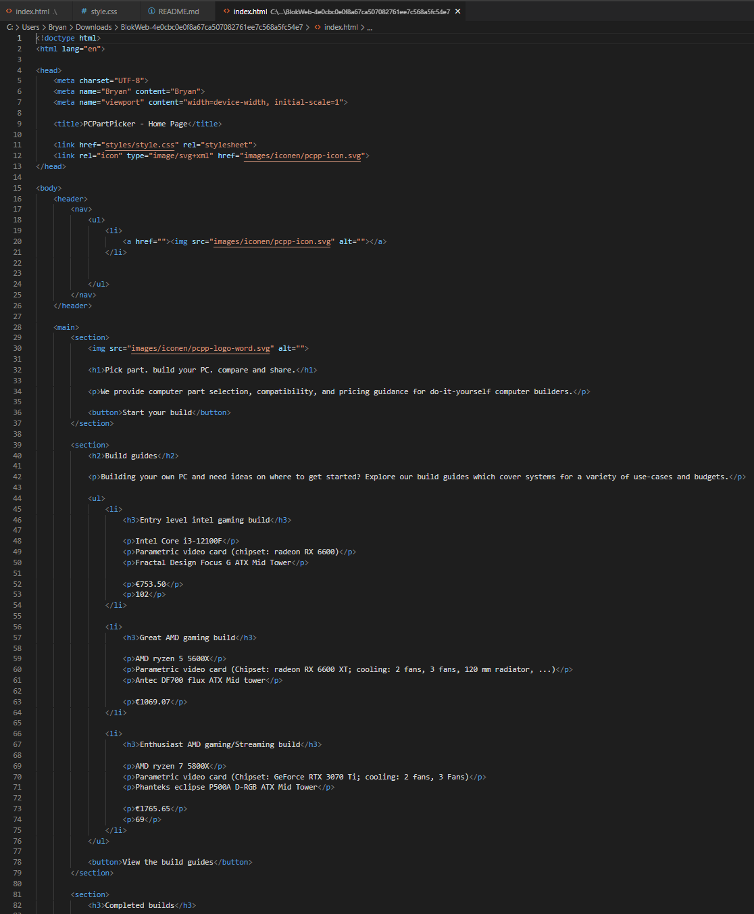
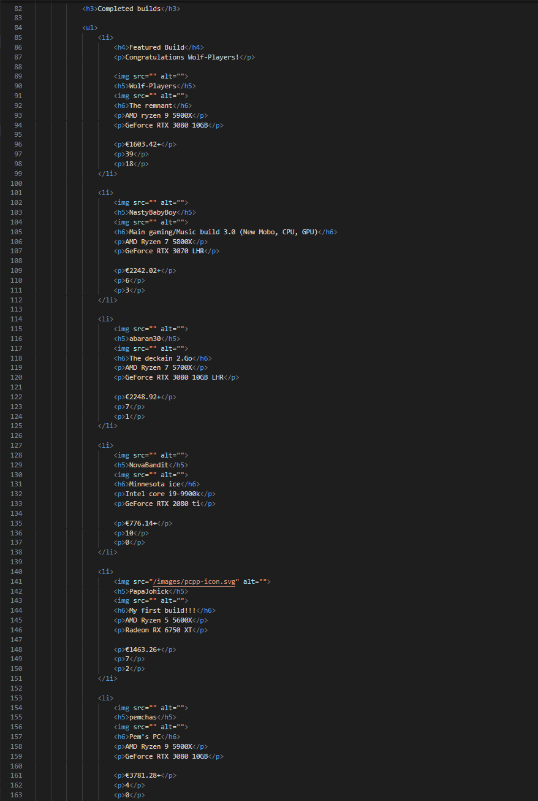
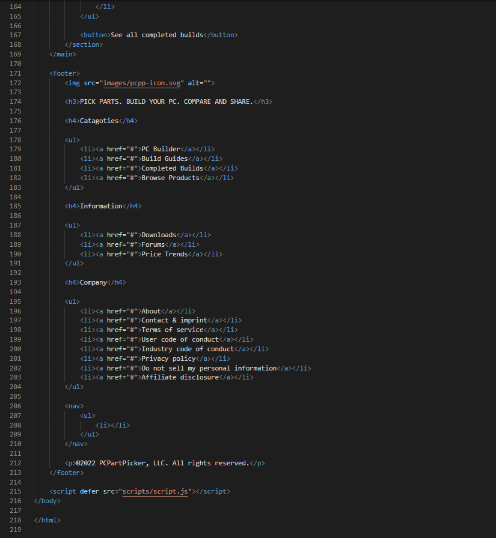

# Procesverslag
Markdown is een simpele manier om HTML te schrijven.  
Markdown cheat cheet: [Hulp bij het schrijven van Markdown](https://github.com/adam-p/markdown-here/wiki/Markdown-Cheatsheet).

Nb. De standaardstructuur en de spartaanse opmaak van de README.md zijn helemaal prima. Het gaat om de inhoud van je procesverslag. Besteedt de tijd voor pracht en praal aan je website.

Nb. Door *open* toe te voegen aan een *details* element kun je deze standaard open zetten. Fijn om dat steeds voor de relevante stuk(ken) te doen.

## Jij

  
uitwerken voor kick-off werkgroep

  ### Auteur:
  Bryan Ortiz Franco

  #### Je startniveau:
  Mijn startniveau is gemiddeld (blauw)

  #### Je focus:
  Ik richt me vooral op responsive en wat surface plane om het wat toegankelijker te maken voor meer mensen
 

## Je website

  
uitwerken voor kick-off werkgroep

  ### Je opdracht:
  Dit is de website die ik ga namaken [PC part picker](https://pcpartpicker.com)
)
  #### Screenshot(s) van de eerste pagina (small screen): 
  Dit is de Home-pagina van PC-partpicker
  

  #### Screenshot(s) van de tweede pagina (small screen):
  Op deze pagina kun je complete PC buils vinden.
  

## Toegankelijkheidstest 1/2 (week 1)

  
uitwerken na test in 1e werkgroep

  ### Bevindingen
  Lijst met je bevindingen die in de test naar voren kwamen:
  - Tekst is gemakkelijk te lezen in alle kleurenblindheid.
  - Advertentie staan goed apart.
  - Darkmode button verdwijnt en wordt verplaatst naar profiel. Dit zou beter verplaatst worden naar instellingen.

  #### Screenreader
  - Er staan veel onzichtbare html text dat niet te zien is maar wel word opgelezen.

  #### Muis en Toetsenbord
  - Er staan veel onzichtbare html text dat niet te zien is maar wel word opgelezen.
  - Headings hebben niet de juiste namen.

  #### Motoriek (shocks, elastiekjes)
  - De knoppen zitten te dicht op elkaar, waardoor het bijna onmogelijk is om de gewenste knop in te drukken.

  #### Visueel (brillen, contrast, kleurenblind, dark/light). 
  - Blurred vision: text was niet goed te lezen.
  - Achromatopsia: de gekleurde hover knoppen zijn niet te zien.
  - Dark mode en light zouden een paar veranderingen kunnen krijgen om ze beter te onderscheiden.

## Breakdownschets (week 1)

  
uitwerken na afloop 2e werkgroep

  ### De hele pagina:
  

  ### De drop-down menu:
  

  ### De Build guides carrousel:
  

## Voortgang 1 (week 2)

  
uitwerken voor 1e voortgang

  ### Stand van zaken
  hier dit ging goed & dit was lastig (neem ook screenshots op van delen van je website en code)

  Dit is mijn eerste opmaak van mijn website.
  

  Deze week had ik het een beetje druk dus heb ik alleen gemaakt waar ik kon. 
  Ik ben ook html en css een beetje vergeten omdat ik het het laatste half jaar niet veel gedaan heb.

  Dit is mijn voortgang van mijn code tot nu toe.

  HTML
  

  

  CSS
  

  

  ### Agenda voor meeting
  samen met je groepje opstellen

  | Bryan                                          | Daan               | Jordi        | Lars                                                           | Zennay           |
  | ---                                            | ---                | ---          | ---                                                            | ---              |
  | Of mijn HTML en CSS code wel goed opgemaakt is | en dit             | en ik dit    | Hoe kan ik het beste mijn css structureren?                    | en dan ik dat    |
  | Hoe maak ik een dropdown menu                  | dit als er tijd is | nog een punt | background-image werkt niet, waar ligt dat aan?                | dit wil ik zeker |
  | De icontjes vinden voor de website             | ...                | ...          | Is het gebruikelijk om af te wisselen in display grid en flex? | ...              |

  ### Verslag van meeting
  hier na afloop snel de uitkomsten van de meeting vastleggen

  - Elke kleur een huisstijl naam geven en het verwijzen naar waar het gebruikt worden. Als : —huisstyle-kleur(); en dan zoals —bg-nav:
  - Elke a hef moet in een aparte li
  - Elke section een naam geven in ccs
  - Div mag gebruikt worden voor styling
  - Gebruik Emet om snel te coderen
  - Mijn Css een logische volgorde geven
  - Afbeeldingen de juiste naam geven

## Voortgang 2 (week 3)

  
uitwerken voor 2e voortgang

  ### Stand van zaken
  Dit is de opmaak van mijn website voor de tweede voortgangs gesprek.
  

  Deze week heb ik weinig tijd gehad om aan mijn website te werken, maar ik ga proberen volgende week meer tijd aan mijn website te besteden.
  Wat ik tot nu toe heb kunnen doen is alle inhoud in de pagina krijgen en deze stylen met css.

  Dit is mijn voortgang van mijn code tot nu toe.

  HTML
  

  

  

  CSS
  

  

  

  ### Agenda voor meeting
  samen met je groepje opstellen

  | Bryan                                                | Daan           | Jordi              | Lars         | Zennay           |
  | ---                                                  | ---            | ---                | ---          | ---              |
  | Hoe krijg ik de afbeeldingen goed op plaats?         | ---            | ---                | ---          | ---              |
  | Hoe krijg ik de nav goed aan het werk?               | dit bespreken  | en dit             | en ik dit    | en dan ik dat    |
  | hoe kan ik de linker gap weghalen bij mijn carrousel | en dat ook nog | dit als er tijd is | nog een punt | dit wil ik zeker |
  | Hoe style je met div?                                | ...            | ...                | ...          | ...              |

  ### Verslag van meeting
  hier na afloop snel de uitkomsten van de meeting vastleggen

  - Tip: let op dubbele code
  - Css reset voor box-sizing
  - @font-face {} kun je fonts downloaden en gebruiken in je website Src: url (?/font/font\ font type\ font name);
  - fix de problemen in mijn website wat in /**/ staan

## Toegankelijkheidstest 2/2 (week 4)

  
uitwerken na test in 8e werkgroep

  ### Bevindingen
  Lijst met je bevindingen die in de test naar voren kwamen (geef ook aan wat er verbeterd is):

  #### Screenreader
  Hier korte omschrijving (met indien nodig afbeeldingen)

  Hier een omschrijving van hoe het opgelost kan worden (met indien nodig afbeeldingen)

  #### Muis en Toetsenbord 
  Hier korte omschrijving (met indien nodig afbeeldingen)

  Hier een omschrijving van hoe het opgelost kan worden (met indien nodig afbeeldingen)

  #### Motoriek (shocks, elastiekjes)
  Hier korte omschrijving (met indien nodig afbeeldingen)

  Hier een omschrijving van hoe het opgelost kan worden (met indien nodig afbeeldingen)

  #### Visueel (brillen, contrast, kleurenblind, dark/light). 
  Hier korte omschrijving (met indien nodig afbeeldingen)

  Hier een omschrijving van hoe het opgelost kan worden (met indien nodig afbeeldingen)

## Voortgang 3 (week 4)

  
uitwerken voor 3e voortgang

  ### Stand van zaken
  hier dit ging goed & dit was lastig (neem ook screenshots op van delen van je website en code)

  Deze week had ik moeite om het dropdown menu aan de praat te krijgen. uiteindelijk is het gelukt met de hulp van sanne.
  Ook was het deze week moeilijk om tijd vrij te maken om aan de website te werken. 

  Dit is mijn voortgang van mijn code tot nu toe.

  HTML
  

  

  

  CSS
  

  

  

  Java Script
  

  ### Agenda voor meeting
  samen met je groepje opstellen
  
  | Bryan                                                         | Daan               | Jordi        | Lars             | Zennay           |
  | ---                                                           | ---                | ---          | ---              | ---              |
  | kan ik 2 style sheet gebruiken of moet ik meteen 3 gebruiken? | en dit             | en ik dit    | en dan ik dat    | en dan ik dat    |
  | ziet mijn html en css code er to nu toe er goed uit?          | dit als er tijd is | nog een punt | dit wil ik zeker | dit wil ik zeker |
  | hoe verandere ik de kleur van de svg bestand in css           | ...                | ...          | ...              | ...              |

  ### Verslag van meeting
  hier na afloop snel de uitkomsten van de meeting vastleggen

  - punt 1
  - punt 2
  - nog een punt
  - ...

## Eindgesprek (week 5)

  
uitwerken voor eindgesprek

  ### Je uitkomst - karakteristiek screenshots:
  

  ### Dit ging goed/Heb ik geleerd: 
  Korte omschrijving met plaatjes

  

  ### Dit was lastig/Is niet gelukt:
  Korte omschrijving met plaatjes

  

## Bronnenlijst

  
continu bijhouden terwijl je werkt

  Nb. Wees specifiek ('css-tricks' als bron is bijv. niet specifiek genoeg).

  1. CSS lay-out: Sanne 't Hooft
  2. HTML lay-out: Sanne 't Hooft en
  3. li klikbaar: Sanne 't Hooft
  4. center li: Sanne 't Hooft
  5. h4 line: Sanne 't Hooft
  6. code (*, *::after, *::before): Sanne 't Hooft
  7. root lay-out:  Sanne 't Hooft
  8. [nav lay-out: Soure: CodePen Home FED 22/23 - Flexbox - Oefening 1 - uitwerking - sommetje 11](https://codepen.io/shooft/pen/VwXXNea?editors=1100)
  9. [remove line under link - code: text-decoration: none;](https://stackoverflow.com/questions/2789703/remove-blue-underline-from-link)
  10. [Maakt elke eerste letter cappital Code: text-transform: capitalize;](https://love2dev.com/blog/css-text-transform/#:~:text=The%20CSS%20text%2Dtransform%20Property,-The%20CSS%20text&text=uppercase%3A%20makes%20all%20of%20the,exactly%20as%20it%20was%20entered)
  11. [Github image align left](https://stackoverflow.com/questions/12090472/how-do-i-center-an-image-in-the-readme-md-file-on-github)
  12. [Sticky header Source: FED 22/23 - Flexbox - Oefening 2 - uitwerking](https://codepen.io/shooft/pen/zYWWXmG)
  13. [Text-contrast change](https://developer.mozilla.org/en-US/docs/Web/CSS/filter-function/contrast)

